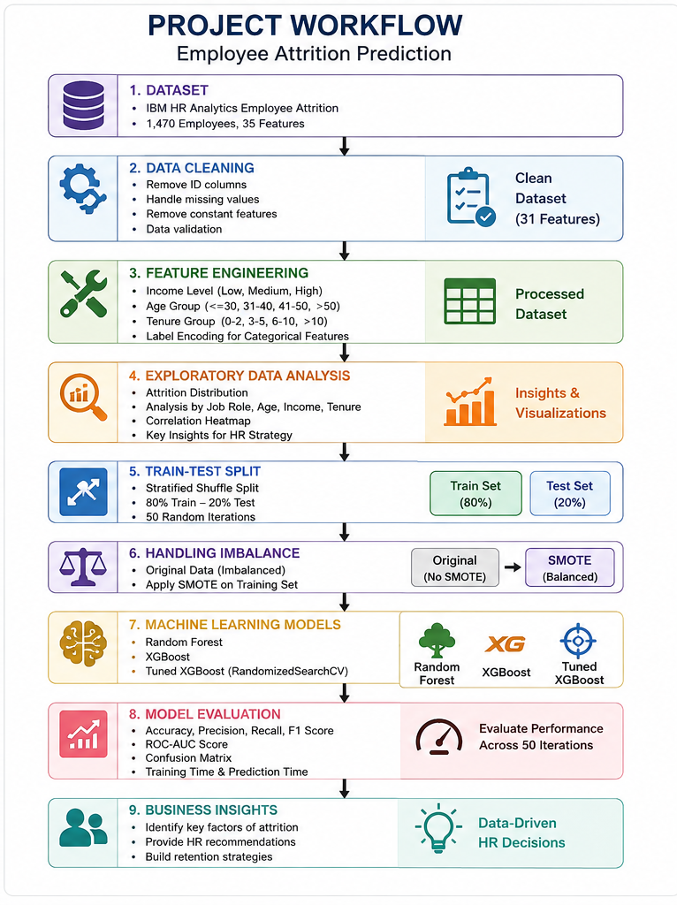
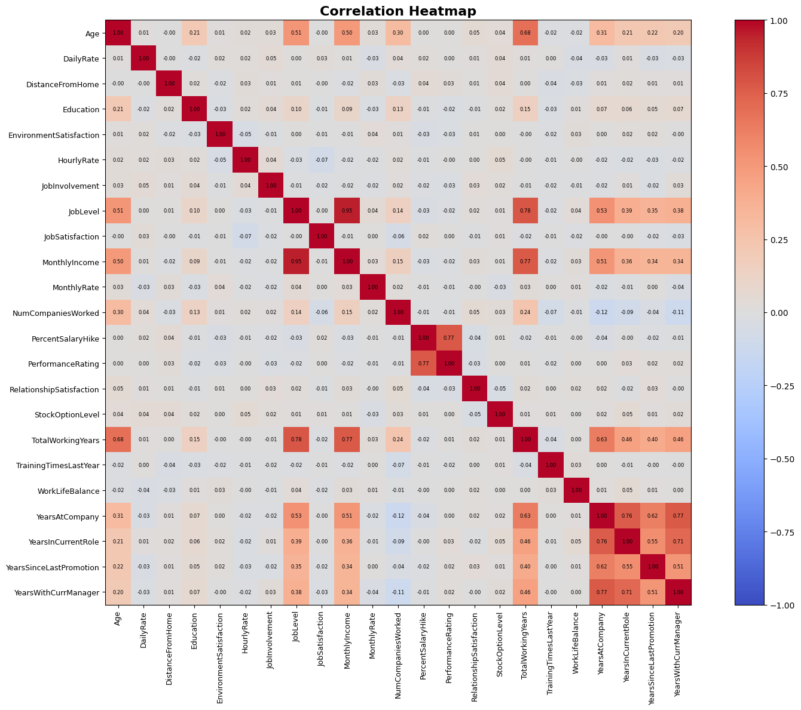
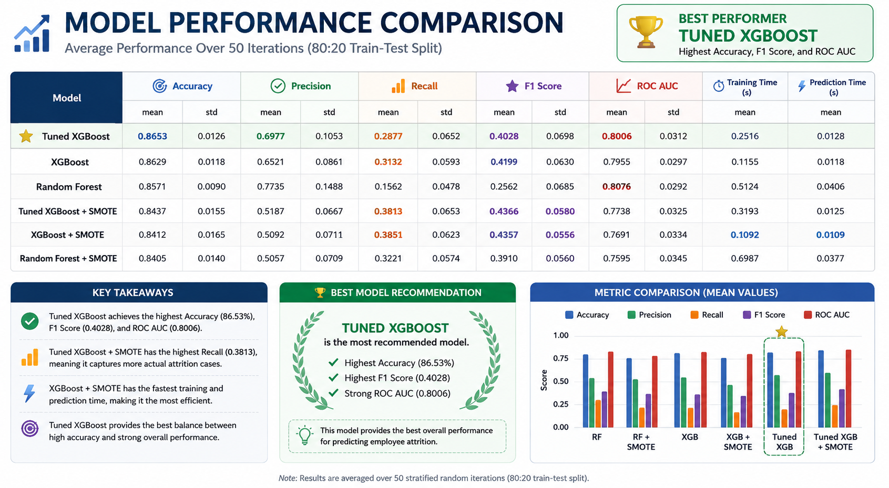
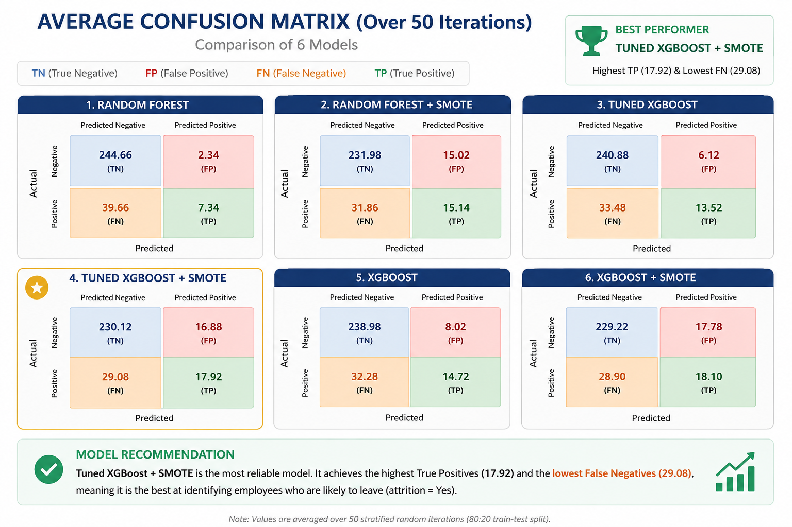

# 👨‍💼 Employee Attrition Prediction using Machine Learning

Predicting employee attrition is one of the most important tasks in Human Resource Analytics. This project develops an end-to-end machine learning pipeline to identify employees at risk of leaving the company using the IBM HR Analytics Employee Attrition dataset.

The project covers data preprocessing, exploratory data analysis, feature engineering, class imbalance handling using SMOTE, model optimization, and comprehensive evaluation across 50 randomized train-test splits.

## 🎯 Business Problem

Employee turnover is costly for organizations because it increases recruitment expenses, training costs, and productivity loss.

Instead of reacting after employees resign, companies can use predictive analytics to identify employees with a high risk of attrition and implement proactive retention strategies.

This project aims to answer the following questions:

- Which employees are most likely to leave?
- Which factors contribute most to employee attrition?
- Which machine learning model provides the best predictive performance?

- ## 🔄 Project Workflow

## 📂 Dataset

**Dataset:** IBM HR Analytics Employee Attrition & Performance

- Total Employees : 1,470
- Features : 35
- Target : Attrition

Target classes

- No
- Yes

## 📊 Exploratory Data Analysis

### Attrition Distribution

### Attrition by Job Role

### Correlation Heatmap

## 🤖 Machine Learning Pipeline

The following models were evaluated:

- Random Forest
- Random Forest + SMOTE
- XGBoost
- XGBoost + SMOTE
- Tuned XGBoost
- Tuned XGBoost + SMOTE

Evaluation strategy:

- Stratified Shuffle Split
- 50 Random Iterations
- Train-Test Ratio = 80:20

Evaluation Metrics:

- Accuracy
- Precision
- Recall
- F1 Score
- ROC-AUC
- Confusion Matrix
- Training Time
- Prediction Time

## 📈 Model Performance Comparison

The six machine learning models were evaluated using 50 randomized stratified train-test splits (80:20) to ensure robust and reliable performance estimates.

Among all evaluated models, **Tuned XGBoost** achieved the highest overall Accuracy (86.53%), while maintaining competitive Precision (69.77%) and a strong ROC-AUC score (0.8006). These results indicate that hyperparameter tuning successfully improved the model's overall predictive performance.

Although SMOTE-based models achieved higher Recall, Tuned XGBoost demonstrated the best overall classification performance in terms of correctly classifying employees across both classes. Therefore, it is considered the strongest model from an overall predictive performance perspective.

## 📉 Average Confusion Matrix

- The confusion matrix comparison shows that the Tuned XGBoost + SMOTE model achieves a high number of True Positives while maintaining a relatively low False Negative rate.
- Reducing False Negatives is particularly important because it minimizes the number of employees who are incorrectly predicted to stay despite being at risk of leaving the organization.

## 🏆 Why Tuned XGBoost + SMOTE?

- Although Tuned XGBoost achieved the highest overall accuracy, employee attrition prediction is an imbalanced classification problem where correctly identifying employees who are likely to resign is more important than maximizing accuracy alone.
- The Tuned XGBoost + SMOTE model provides a better balance between Precision and Recall, resulting in the highest F1 Score among all evaluated models.
- In addition, this model substantially reduces False Negatives, meaning fewer employees at risk of resignation are overlooked.
- Therefore, Tuned XGBoost + SMOTE is selected as the final model because it offers the best balance between predictive performance and business usefulness.

## 💼 Business Insights

The analysis reveals several important findings:

- Employees working overtime exhibit significantly higher attrition.
- Younger employees tend to resign more frequently.
- Employees with lower monthly income have higher turnover rates.
- Sales Representatives and Laboratory Technicians show the highest attrition rates.
- Employees with shorter tenure are more likely to leave the organization.

## 🚀 HR Recommendations

Based on these findings, organizations should prioritize:

- Monitoring employee overtime.
- Improving work-life balance.
- Reviewing compensation strategies.
- Enhancing onboarding programs.
- Providing clearer career development opportunities.

## 📌 Results

- Six machine learning models were evaluated.
- Performance was assessed using 50 randomized stratified train-test splits.
- SMOTE effectively improved the model's ability to detect minority-class employees.
- Hyperparameter tuning further enhanced the balance between Precision and Recall.
- Tuned XGBoost + SMOTE achieved the best overall balance and was selected as the final predictive model.

## 🔮 Future Improvements

Possible future enhancements include:

- Implement Explainable AI (SHAP or LIME) for model interpretability.
- Deploy the model as an interactive web application using Streamlit.
- Integrate additional HR datasets for better generalization.
- Explore deep learning approaches for attrition prediction.
- Build a real-time employee attrition monitoring dashboard.

## 👩‍💻 Author

**Tiara Azahra Wika Putri**

📧 Email: your_email@example.com

💼 LinkedIn:
https://www.linkedin.com/in/tiaraazahrawikaputri

💻 GitHub:
https://github.com/azahratawp-ctrl
